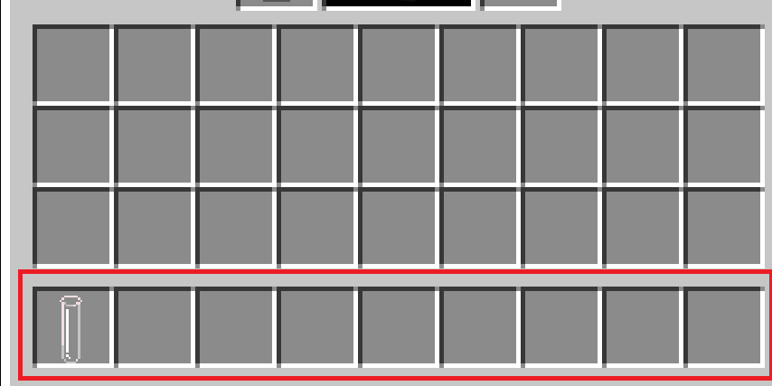
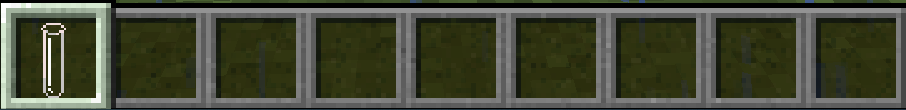
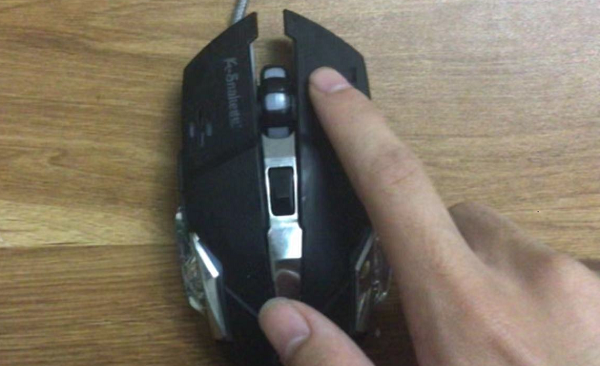

[上一页](1.1.md) [返回目录](index.md)   3

# 第一章 1.2  使用反应器材
##  **______________________________________________**
## 目标
### 上节课了解模组的反应器材和反应器材的合成方法，这节课需要学会使用反应器材。
##  **______________________________________________**
## 1首先，需要使用上节课合成的试管，然后放在主手。
## 2把要放入试管的物品放入副手。物品放入副手有两种方法，如下
### 方法1
#### 把物品拖到副手栏

 

### 方法2
####  1.把物品放入快捷栏

####  2.手持

#### 3.按下F键(默认键位)

## 4点击或按下交互键(右键)，把物品放入试管

## 分别放入固体和液体的试管图片

## 3取出物品
### 蹲下(潜行)，点击或按下交互键(右键)拿出物品